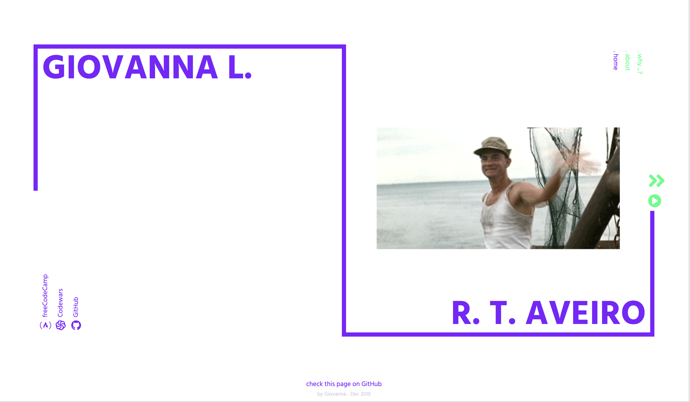

# Website to support my application to Founders and Coders 2020 spring cohort

 
## Prerequisites
As per December 2019, [Founders and Coders](https://www.foundersandcoders.com) application prerequisites are :scream::

* Create a personal website
    * Create a one-page website in HTML and CSS (using some vanilla JavaScript if you’d like) and host it on GitHub Pages. [Your commit history should tell a story](https://www.mokacoding.com/blog/your-git-log-should-tell-a-story/), and your website must be written by you, and:
    * Show us with your code who you are
    * Demonstrate your learning from the prerequisites
    * Tell us about why you are applying for the programme
    * Contain a link back to the GitHub repo that contains the code for your site
    * Contain links to your freeCodeCamp (please make sure that your profile is public) and Codewars pages
    * Be hosted on Github
    * Not use a GitHub theme
    * Not use any JavaScript or CSS libraries like Bootstrap or jQuery or use an image carousel package like Flickity ⁠— we want to see your own code.
    * Include an image [carousel](https://github.com/foundersandcoders/master-reference/blob/master/coursebook/prerequisites/image-carousel.md) (the image carousel must be built into your website, a link to a separate page or CodePen will not be accepted) that meets the following criteria:
        * Responsive (works on mobile and desktop)
        * Display one image at a time
        * Move between images when clicking navigation buttons
        * Toggle automatically looping through all images with a play/pause button
        * Allow keyboard navigation between images with the left/right arrow keys
        * Learning outcomes
        * Document Object Model (DOM)
        * Accessing and manipulating the DOM with JavaScript
        * Adding event listeners to react to user input
        * You're more than welcome to be creative with your project as long as you meet the minimum features and the learning outcomes.
* [Codewars](https://www.codewars.com) - Reach 5 kyu and 300 honor points in JavaScript on Codewars.
* [freeCodeCamp](https://www.freecodecamp.org) - Earn a minimum of 250 points on freeCodeCamp. Please complete the following sections, then explore other sections that interest you:
    * Responsive Web Design Certification
        * Basic HTML and HTML5
        * Basic CSS
        * Responsive Web Design Principles
        * CSS Flexbox
    * JavaScript Algorithms and Data Structures Certification
        * Basic JavaScript
        * ES6
        * Basic Data Structures
        * Basic Algorithm Scripting

## Implementation 

This responsive single-page website was built with HTML, CSS and Javascript.

To meet the requirements, I wanted the website to contain a welcoming landing page, some information about me and the reasons why I should join the Founders and Coders community. These were then made into three separate slides of a carousel. 

**Carousel:** 
The carousel `<section>` takes the right side of the viewport when in desktop mode and the bottom half on narrower screens. JavaScript was used to loop through the slides `surname`, `about` and `why` which is achieved with a `<d-none>` tag added to the slides that aren't visible at a given point. To navigate through the content, the user has the option of playing an automated slideshow, use the arrow buttons, the keyboard right/left arrow keys or the navigation bar. 
